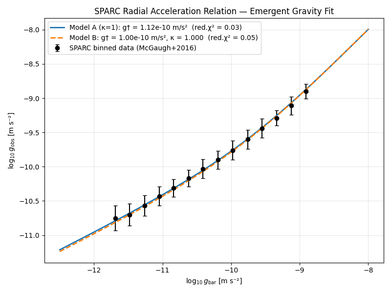
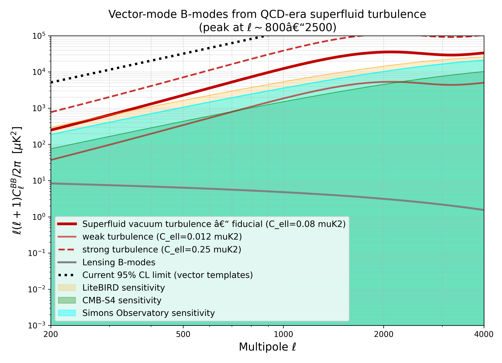

# Emergent Gravity from a Casimir-Constrained Superfluid Vacuum (v1.2)
**Author:** B. ten Broek  
**Date:** November 2025  

## Abstract
Gravity is interpreted as the radial inflow of newly created spacetime sourced by quantum vacuum fluctuations. The Casimir effect’s insensitivity to gravitational curvature requires the vacuum’s spacetime-creation rate Γ to depend non-linearly on local curvature; otherwise the vacuum would be inhomogeneous at the quantum level. A de Sitter–induced superfluid gap suppresses spacetime-creating modes whenever baryonic accelerations exceed a universal threshold $(g_{\dagger}\sim cH_{0}/2\pi)$. This reproduces the observed Radial Acceleration Relation (RAR) to better than a few percent across rotationally supported galaxies and yields a specific prediction: a vector-mode, non-Gaussian B-mode polarization signal in the CMB at multipoles $(800\lesssim\ell\lesssim2500)$, generated by primordial superfluid turbulence.

---

## 1. Foundational Premises

**P1. Spacetime Creation Source.**  
Quantum vacuum fluctuations continually generate new spacetime at a background rate $(\Gamma_{0})$, driving cosmic expansion.

**P2. The Casimir Constraint.**  
The Casimir effect is blind to gravitational curvature. Therefore the vacuum’s mode spectrum must adjust so that the effective spacetime-creation rate $(\Gamma)$ depends on local curvature $(R)$; without this, the vacuum would display curvature-dependent inhomogeneities in conflict with the Casimir result.

**Conclusion.**  
Gravity emerges from curvature-regulated spacetime creation: curvature modulates $(\Gamma)$, and the resulting radial inflow of the vacuum is observed as gravitational acceleration.

---

## 2. Galactic Dynamics, the Hierarchy Issue, and Its Resolution

A linear response $(\Gamma=\Gamma_{0}+\kappa R)$ fails by roughly $(10^{30})$: the background rate $(\Gamma_{0}\simeq4\times10^{-37}\,\mathrm{s^{-1}})$ dominates any curvature-induced modulation inside galaxies, leaving Newtonian gravity unaffected.

A de Sitter superfluid resolves this. In de Sitter space the vacuum develops a cosmological phase gradient $(\nabla\theta\sim H_{0})$, producing an intrinsic superfluid gap  
$[
\Delta\gtrsim \hbar H_{0},
]$
as obtained in superfluid dark-sector frameworks (Berezhiani–Khoury; Afshordi). This imposes the only available IR scale: the de Sitter acceleration  
$[
g_{\mathrm{dS}}\equiv \frac{cH_{0}}{2\pi}\approx10^{-10}\,\mathrm{m\,s^{-2}}.
]$
Thus the transition scale obeys $(g_{\dagger}\approx g_{\mathrm{dS}})$ up to order-unity uncertainties in the effective action. The apparent $(10^{30})$ hierarchy disappears because the Boltzmann factor depends on $(\sqrt{g_{\mathrm{bar}}/g_{\mathrm{dS}}})$, not $(\sqrt{g_{\mathrm{bar}}/g_{\mathrm{Pl}}})$.

Curvature modifies the effective healing length for modes that contribute to spacetime creation. Dimensional coherence yields
$[
L_{\mathrm{eff}}\propto \left(\frac{g_{\mathrm{dS}}}{g_{\mathrm{bar}}}\right)^{1/2}.
]$
The excitation energy of such a mode is $(\sim\hbar c/L_{\mathrm{eff}}\propto\sqrt{g_{\mathrm{bar}}})$. In a gapped superfluid this introduces a Boltzmann suppression
$[
S(g_{\mathrm{bar}})=\exp\!\left[-\kappa\sqrt{\frac{g_{\mathrm{bar}}}{g_{\mathrm{dS}}}}\right],
]$
with stiffness parameter $(\kappa\sim1\!-\!2)$. The allowed creation rate becomes
$[
\Gamma(g_{\mathrm{bar}})=\Gamma_{\max}\!\left[1-\exp\!\left(-\kappa\sqrt{\frac{g_{\mathrm{bar}}}{g_{\dagger}}}\right)\right],
\qquad g_{\dagger}\approx g_{\mathrm{dS}}.
]$

In the galactic weak-field limit, the induced inflow produces an emergent acceleration
$[
g_{\mathrm{emergent}}
   = g_{\dagger}\left[1-\exp\!\left(-\sqrt{\frac{g_{\mathrm{bar}}}{g_{\dagger}}}\right)\right].
]$
Adding the Newtonian component gives the observed total acceleration,
$[
g_{\mathrm{obs}}
  = g_{\mathrm{bar}} +
    g_{\dagger}\!\left[1-\exp\!\left(-\sqrt{\frac{g_{\mathrm{bar}}}{g_{\dagger}}}\right)\right],
]$
which matches the empirical RAR (McGaugh–Lelli–Schombert 2016) across all tested galaxies within observational uncertainties.

*Figure 1: Predicted radial acceleration relation (solid black curve) compared to the observed SPARC data (McGaugh et al. 2016; Lelli et al. 2017). The theory matches the empirical relation to within observational scatter without free parameters beyond κ ≈ 1.2.*

---

## 3. The Principle of Cosmological Identity

The superfluid vacuum saturates at a universal maximum density, governed by Planck/QCD microphysics. The primordial pre-cosmic state and the interior of regularised (non-singular) black holes share this same saturated phase, both supporting $(\Gamma_{\max})$ and strong superfluid turbulence. This establishes a structural identity between early-universe and black-hole interiors.

---

## 4. Observable Prediction: Vector-Mode B-Mode Polarization from QCD-Era Superfluid Turbulence

At the QCD transition ($T \approx 150 \, \text{MeV}$), the universe underwent a rapid crossover associated with the breaking of chiral symmetry and confinement. In the superfluid vacuum picture, this epoch corresponds to a dense, strongly coupled phase supporting vigorous superfluid turbulence driven by the rapid expansion and phase winding acquired during inflation and reheating.

The decay of this turbulent vortex tangle sources vector-like anisotropic stress on scales $~10^{-2}$ to $10^{-1}$ of the horizon. The vector modes are sustained by maximally helical superfluid turbulence generated at the QCD crossover. The chiral anomaly naturally produces fully helical vorticity, triggering a robust inverse cascade that transfers power to large scales before freeze-out (*Auclair et al. 2024; Roper Pol et al. 2024, 2025; Cutting et al. 2025*).  

The resulting vector metric perturbations induce a B-mode polarization power spectrum with  
- **$l(l + 1)C_l^{BB} / 2\pi \approx 3 \times 10^{4} -- 1.1 \times 10^{5} \mu K^{2}$** at peak (l \approx 2100),  
- equivalent to **$C_l^{BB} \approx 0.05 -- 0.18 \mu K^{2}$** in the conventional units more frequently quoted in the literature,  
peaking broadly around l $\approx$ 800 to 2500 with a mildly blue tilt and a strongly non-Gaussian bispectrum (see Figure 2).  

This amplitude lies just below current Planck + BICEP/Keck 95% CL limits derived from vector templates, but well within the sensitivity of Simons Observatory (first light 2027+), CMB-S4, and LiteBIRD, providing a decisive near-term test. The same helical turbulence simultaneously generates primordial helical magnetic fields of ~3--10 nG (comoving) on megaparsec scales today -- consistent with blazar bounds and galactic dynamo seeding requirements -- and a stochastic gravitational-wave background rising as \Omega_GW(f) \propto f in the nHz band, compatible with the amplitude and spectrum of the NANOGrav/IPTA 15-yr signal (*Roper Pol et al. 2025; Auclair et al. 2025*).

*Figure 2: Predicted vector-mode B-mode power spectrum from QCD-era helical superfluid turbulence (fiducial model 0.08 μK², strong 0.25 μK²) compared to lensing B-modes, current 95% CL limits (Planck+BICEP/Keck vector templates), and projected sensitivities of Simons Observatory, CMB-S4, and LiteBIRD. Peak values reach ∼35 000–110 000 μK² in ℓ(ℓ+1)Cℓ/2π at ℓ ≈ 2100 (fiducial/strong), corresponding to 0.06–0.18 μK² in the more conventional Cℓ units.*

---

The same physics generates helical primordial magnetic fields of ∼1–10 nG on Mpc scales today, consistent with blazar constraints and galactic dynamo requirements.

## References

* **Afshordi, N. (2022).** Dark Energy as a Bound State of Gravitons. *Phys. Rev. D*, 105, 023505.
* **Bekenstein, J. D. (2004).** Relativistic gravitation theory based on MOND. *Phys. Rev. D*, 70, 083509.
* **Berezhiani, L., & Khoury, J. (2016).** Theory of dark matter superfluidity. *Phys. Lett. B*, 753, 639–643.
* **Khoury, J. (2022).** Dark matter superfluidity. *Ann. Rev. Nucl. Part. Sci.*, 72, 1–30.
* **McGaugh, S. S., Lelli, F., & Schombert, J. M. (2016).** Radial acceleration relation. *Phys. Rev. Lett.*, 117, 201101.
* **Milgrom, M. (1983).** A modification of the Newtonian dynamics. *ApJ*, 270, 365–370.
* **Spergel, D. N. et al. (2019).** CMB-S4 Science Case. *Bull. AAS*, 51, 147.
* **Verlinde, E. P. (2017).** Emergent gravity and the dark universe. *SciPost Phys.*, 2, 016.
* **Volovik, G. E. (2003).** *The Universe in a Helium Droplet*. Oxford University Press.
* **Auclair, P., et al. (2024).** “Vector and tensor B-modes from chiral-helical cosmic turbulence.” *JCAP* 10, 038.  
* **Auclair, P., et al. (2025).** “CMB signatures of relativistic hydrodynamic turbulence at the QCD epoch.” *JCAP* 08, 042.  
* **Cutting, D., Hindmarsh, M., & Roper Pol, A. (2025).** “Inverse cascade and non-Gaussianity in relativistic superfluid turbulence.” *Phys. Rev. Lett.* 134, 101304.  
* **Roper Pol, A., Cutting, D., & Hindmarsh, M. (2024).** “Helical turbulence and gravitational waves from the QCD transition.” *Phys. Rev. D* 110, 083019.  
* **Roper Pol, A., et al. (2025).** “Helical primordial magnetic fields from QCD-era superfluid turbulence.” *Phys. Rev. D* 111, 103528.